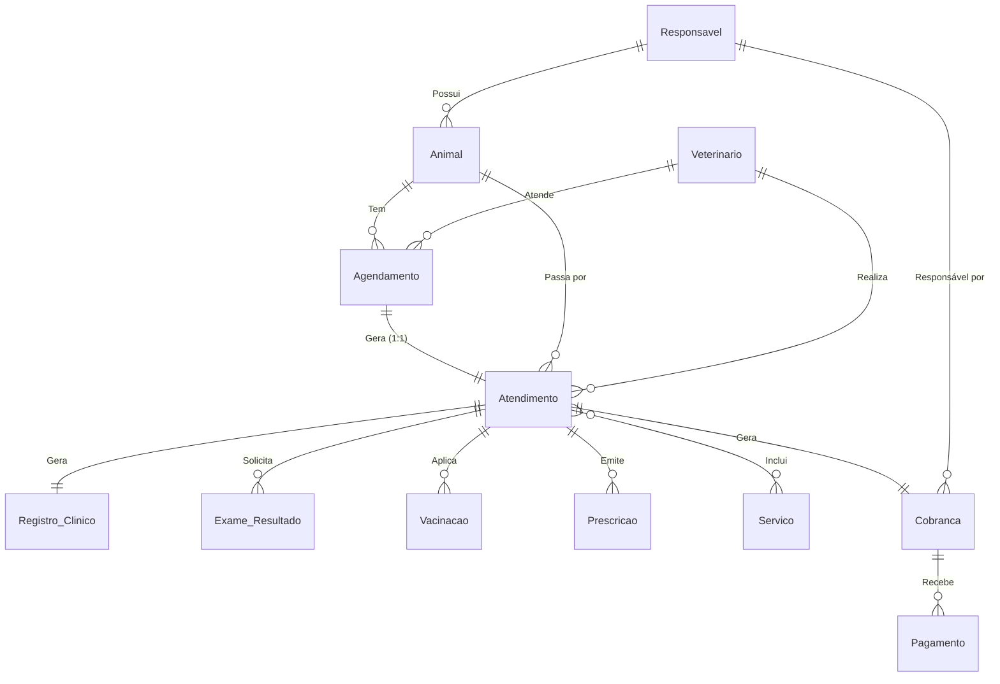

# Sistema de Gestão Veterinária 🐾

Bem-vindo ao repositório do **Sistema de Gestão Veterinária**. Esta é uma aplicação web completa, desenvolvida em PHP (utilizando o padrão arquitetural MVC + DAO), projetada para facilitar o controle de todas as rotinas diárias de uma clínica veterinária.

---

## 📋 Visão Geral

A plataforma permite que clínicas gerenciem desde os cadastros básicos (tutores, pacientes e profissionais) até o fluxo completo do atendimento clínico. Ao longo do processo, o sistema integra o acompanhamento médico com a gestão financeira, garantindo que todo serviço prestado gere suas respectivas cobranças.

---

## 🗄️ Modelagem do Banco de Dados

Para facilitar a compreensão da estrutura lógica do sistema, abaixo estão representados os modelos de dados.

### Modelo Conceitual (Diagrama de Entidade-Relacionamento)

Este diagrama ilustra como as entidades interagem entre si na lógica de negócios da clínica, destacando como um Agendamento evolui para um Atendimento, ramificando-se em Exames, Prescrições, Vacinas e faturamento (Cobrança).

> *Para melhor resolução, consulte o PDF: [Modelo Conceitual (PDF)](./downloads/Modelo_Conceitual_Veterinaria.pdf)*



### Modelo Relacional (Tabelas)

A estrutura relacional abaixo detalha as principais tabelas derivadas do padrão DAO do projeto, evidenciando as chaves e colunas primárias.

> *Para a tabela completa com tipos de dados, consulte o PDF: [Modelo Relacional (PDF)](./downloads/Modelo_Relacional_Veterinaria.pdf)*

| Tabela | Chave Primária (PK) | Chaves Estrangeiras (FK) |
| :--- | :--- | :--- |
| **RESPONSAVEL** | `id_responsavel` | - |
| **ANIMAL** | `id_animal` | `id_responsavel` |
| **VETERINARIO** | `id_veterinario` | - |
| **DISPONIBILIDADE**| `id_disponibilidade` | `id_veterinario` |
| **AGENDAMENTO** | `id_agendamento` | `id_animal`, `id_veterinario` |
| **ATENDIMENTO** | `id_atendimento` | `id_agendamento`, `id_animal`, `id_veterinario` |
| **REGISTRO_CLINICO**| `id_registro` | `id_atendimento`, `id_animal` |
| **EXAME / RESULTADO** | `id_resultado` | `id_exame`, `id_atendimento` |
| **VACINA / APLICACAO**| `id_vacinacao` | `id_vacina`, `id_animal` |
| **PRESCRICAO** | `id_prescricao` | `id_atendimento` |
| **SERVICO_ATENDIMENTO**| `id_atendimento`, `id_servico`| `id_atendimento`, `id_servico` |
| **COBRANCA** | `id_cobranca` | `id_atendimento`, `id_responsavel` |
| **PAGAMENTO** | `id_pagamento` | `id_cobranca` |

---

## 🩺 Funcionalidades Principais

*   **Gestão de Cadastros:** Cadastro de Tutores (Responsáveis), Pacientes (Animais) com suporte a status (Ativo/Inativado, Arquivado/Reativado).
*   **Controle de Agendas:** Configuração de disponibilidade (`disponibilidadeInserir`) por profissional e geração de agendamentos.
*   **Fluxo de Atendimento:** O processo médico tem acompanhamento de status transicionais:
    *   Confirmar
    *   Alterar
    *   Concluir
    *   Cancelar
*   **Prontuário Médico Completo:** Centralização de registros clínicos, laudos de coleta de exames, histórico de vacinação e receitas.
*   **Faturamento:** Os serviços lançados no atendimento disparam automaticamente a criação de cobranças atreladas ao tutor, permitindo a gestão de pagamentos recebidos.

---

## 🛠️ Tecnologias Utilizadas

*   **Linguagem Base:** PHP
*   **Arquitetura:** MVC (Model-View-Controller)
*   **Acesso a Dados:** DAO (Data Access Object) via scripts SQL.
*   **Interface:** HTML, CSS (folhas de estilo personalizadas na pasta view), JS.

---

## 📁 Estrutura do Projeto

O projeto obedece a uma separação de responsabilidades estrita:

```text
/
├── controller/        # Transições de status e lógica de negócios (ex: atendimentoConcluir.php)
├── model/             # Classes de entidades do domínio (ex: animal.php, rotas.php)
├── persist/           # DAO e configuração de banco de dados (ex: conexao.php, animalDAO.php)
├── view/              # Interfaces de usuário, listagens, formulários e assets (css, js, fonts)
├── documentacao/      # Scripts SQL (permissoes.sql, script.sql) e logs de testes
└── index.php          # Ponto de entrada da aplicação
```# Sistema de Gestão Veterinária

Um sistema web completo para gestão de clínicas veterinárias, estruturado com padrão MVC (Model-View-Controller) e DAO (Data Access Object) em PHP.

## 📋 Visão Geral

O sistema permite gerenciar todas as rotinas de uma clínica veterinária, desde o cadastro do paciente e seu tutor até o agendamento, atendimento clínico completo (exames, vacinas, prescrições) e o fluxo financeiro gerado pelas consultas.

## 🗄️ Arquitetura de Banco de Dados

A arquitetura de dados do sistema foi mapeada a partir das entidades e controladores da aplicação. Você pode visualizar os diagramas completos nos PDFs abaixo:

*   [Modelo Conceitual (Entidade-Relacionamento)](./downloads/Modelo_Conceitual_Veterinaria.pdf)
*   [Modelo Relacional](./downloads/Modelo_Relacional_Veterinaria.pdf)

### 📌 Cadastros Principais

*   **Responsável (Tutor):** Pode ser ativado ou inativado no sistema.
*   **Animal (Paciente):** Vinculado a um responsável. Pode ser arquivado ou reativado.
*   **Veterinário:** Profissional que realiza os atendimentos.
*   **Disponibilidade:** Agenda de horários configurada para os médicos veterinários.

### 🩺 Fluxo Clínico

O coração do sistema baseia-se no ciclo de atendimento do paciente:

1.  **Agendamento:** Relaciona um Animal a um Veterinário em uma data e horário específicos.
2.  **Atendimento:** A consulta médica efetiva. Possui os status de Confirmação, Cancelamento e Conclusão.
3.  **Registro Clínico:** Prontuário com as anotações do atendimento.
4.  **Prescrição:** Emissão de receitas médicas.
5.  **Exames e Resultados:** Solicitação de exames no atendimento, com fluxo de coleta de amostras e laudo.
6.  **Vacinação:** Registro da aplicação de vacinas do catálogo durante ou fora da consulta.
7.  **Serviços:** Inclusão de procedimentos realizados no atendimento para composição do valor final.

### 💰 Módulo Financeiro

O sistema gera automaticamente o fluxo financeiro a partir dos atendimentos:

*   **Cobrança:** Gerada vinculada a um atendimento e ao responsável.
*   **Pagamento:** Registro das quitações atreladas às cobranças.
*   **Entrada:** Gestão de outras movimentações (caixa/insumos).

## 🛠️ Tecnologias Utilizadas

*   PHP (Padrão MVC + DAO)
*   Banco de Dados Relacional (SQL)
*   Frontend (HTML, CSS/Estilos Personalizados, JS)

## 📁 Estrutura de Diretórios (Resumo)

*   `/controller`: Lógica de negócios, transições de status e fluxo do sistema (ex: `atendimentoConfirmar.php`).
*   `/model`: Classes de representação de dados das entidades (ex: `animal.php`).
*   `/persist`: Camada DAO para acesso ao banco de dados (ex: `animalDAO.php`).
*   `/view`: Telas, formulários e listagens da aplicação.
*   `/documentacao`: Guias, organização e validações.
