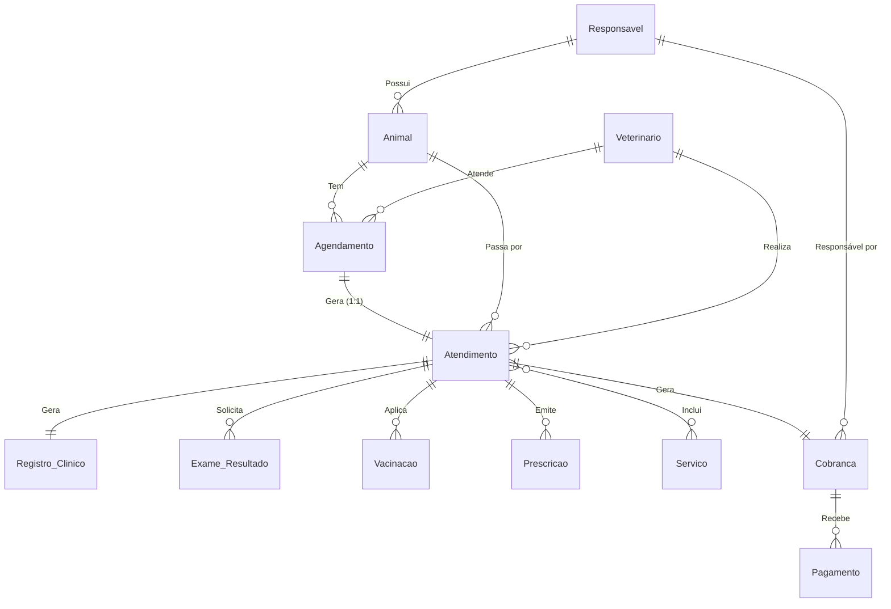
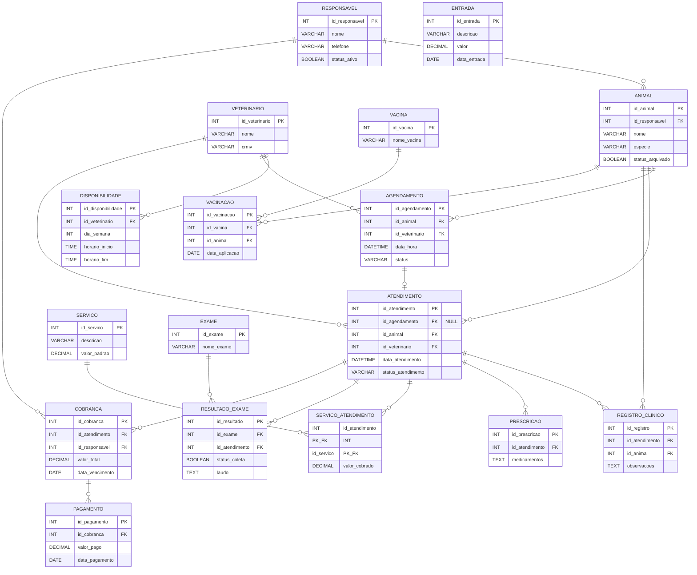

# Sistema de Gestão Veterinária 

### Modelo Conceitual (Diagrama de Entidade-Relacionamento)

### Modelo Relacional (Tabelas)

Representação visual das tabelas criadas no banco de dados e suas ligações estruturais.

