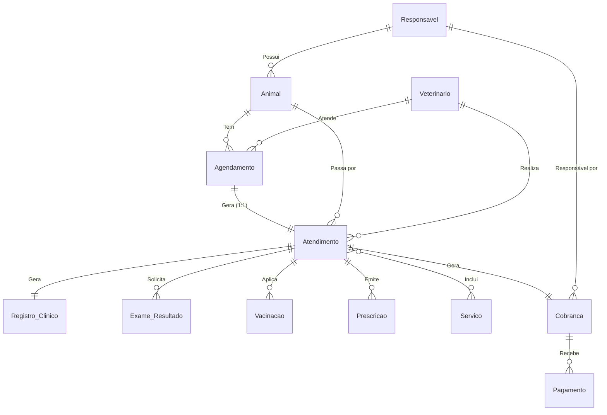
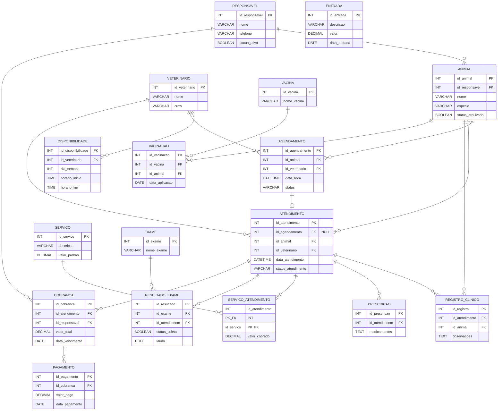

# Sistema de Gestão Veterinária 🐾

Bem-vindo ao repositório do **Sistema de Gestão Veterinária**. Esta é uma aplicação web completa, desenvolvida em PHP (utilizando o padrão arquitetural MVC + DAO), projetada para facilitar o controle de todas as rotinas diárias de uma clínica veterinária.

---

## 📋 Visão Geral

A plataforma permite que clínicas gerenciem desde os cadastros básicos (tutores, pacientes e profissionais) até o fluxo completo do atendimento clínico. Ao longo do processo, o sistema integra o acompanhamento médico com a gestão financeira, garantindo que todo serviço prestado gere suas respectivas cobranças.

---

## 🗄️ Modelagem do Banco de Dados

Para facilitar a compreensão da estrutura lógica do sistema, abaixo estão representados os modelos de dados.

### Modelo Conceitual (Diagrama de Entidade-Relacionamento)

Este diagrama ilustra como as entidades interagem entre si na lógica de negócios da clínica, destacando como um Agendamento evolui para um Atendimento, ramificando-se em Exames, Prescrições, Vacinas e faturamento (Cobrança).

> *Para melhor resolução, consulte o PDF: [Modelo Conceitual (PDF)](./downloads/Modelo_Conceitual_Veterinaria.pdf)*



### Modelo Relacional (Tabelas)

Abaixo, a representação visual das tabelas criadas no banco de dados e suas ligações estruturais.

> *Para a tabela completa com tipos de dados, consulte o PDF: [Modelo Relacional (PDF)](./downloads/Modelo_Relacional_Veterinaria.pdf)*



---

## 🩺 Funcionalidades Principais

*   **Gestão de Cadastros:** Cadastro de Tutores (Responsáveis), Pacientes (Animais) com suporte a status (Ativo/Inativado, Arquivado/Reativado).
*   **Controle de Agendas:** Configuração de disponibilidade (`disponibilidadeInserir`) por profissional e geração de agendamentos.
*   **Fluxo de Atendimento:** O processo médico tem acompanhamento de status transicionais:
    *   Confirmar
    *   Alterar
    *   Concluir
    *   Cancelar
*   **Prontuário Médico Completo:** Centralização de registros clínicos, laudos de coleta de exames, histórico de vacinação e receitas.
*   **Faturamento:** Os serviços lançados no atendimento disparam automaticamente a criação de cobranças atreladas ao tutor, permitindo a gestão de pagamentos recebidos.

---

## 🛠️ Tecnologias Utilizadas

*   **Linguagem Base:** PHP
*   **Arquitetura:** MVC (Model-View-Controller)
*   **Acesso a Dados:** DAO (Data Access Object) via scripts SQL.
*   **Interface:** HTML, CSS (folhas de estilo personalizadas na pasta view), JS.

---

## 📁 Estrutura do Projeto

O projeto obedece a uma separação de responsabilidades estrita:

```text
/
├── controller/        # Transições de status e lógica de negócios (ex: atendimentoConcluir.php)
├── model/             # Classes de entidades do domínio (ex: animal.php, rotas.php)
├── persist/           # DAO e configuração de banco de dados (ex: conexao.php, animalDAO.php)
├── view/              # Interfaces de usuário, listagens, formulários e assets (css, js, fonts)
├── documentacao/      # Scripts SQL (permissoes.sql, script.sql) e logs de testes
└── index.php          # Ponto de entrada da aplicação
```
